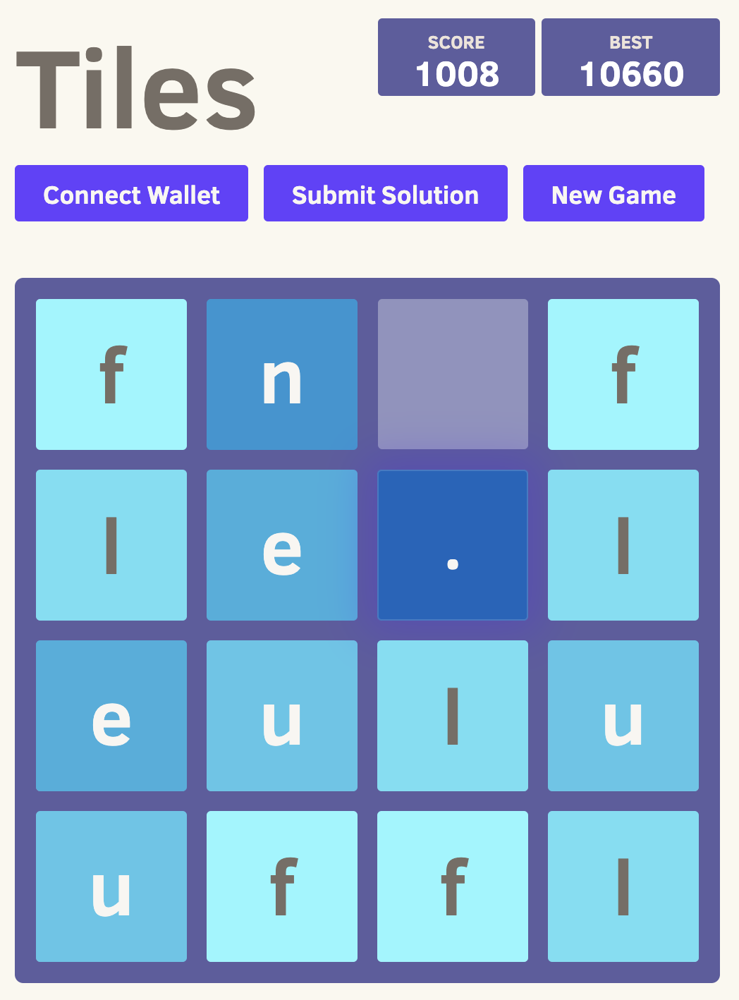

# Tiles game frontend

A simple tiles game. That allows you to play the game and win tokens.
The project is based on the [2048 game](https://github.com/gabrielecirulli/2048).

## How to run?

```sh
npm i -g http-server
http-server
```

## Screenshot



## License

2048 is licensed under the [MIT license.](https://github.com/gabrielecirulli/2048/blob/master/LICENSE.txt)
